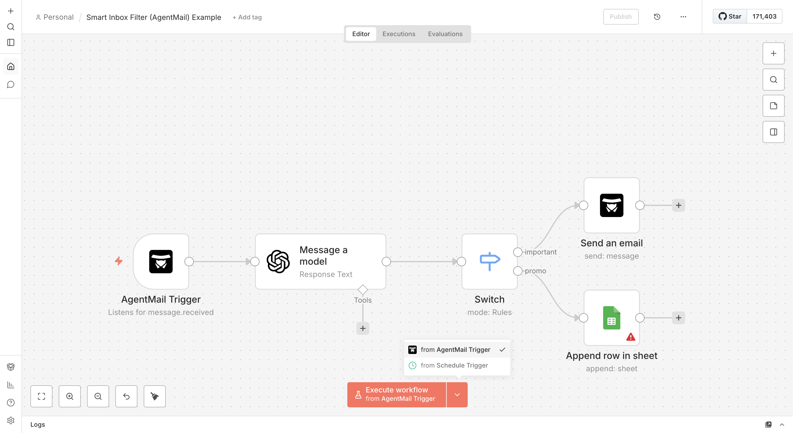
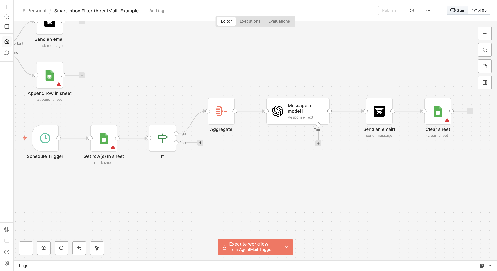

# n8n-nodes-agentmail

This is an n8n community node for [AgentMail](https://agentmail.to) — the Email API for AI Agents.



*Example: AI-powered email triage workflow with AgentMail*

AgentMail lets you create email inboxes for your AI agents so they can send, receive, and act on emails autonomously. No SMTP configuration needed — just an API key.

[n8n](https://n8n.io/) is a [fair-code licensed](https://docs.n8n.io/reference/license/) workflow automation platform.

## Features

### AgentMail Node (Actions)
- **Inbox** — Create, Get, List, Delete inboxes
- **Message** — Send, Reply, Get, List messages
- **Thread** — Get, List email threads
- **Webhook** — Create, List, Delete webhooks

### AgentMail Trigger (Events)
- **Email Received** — Triggers when an inbox gets an email
- **Email Sent** — Triggers when an email is sent
- **Email Delivered** — Triggers when delivery is confirmed
- **Email Bounced** — Triggers when an email bounces

### User-Friendly
- **Inbox dropdown** — Pick inboxes from a list instead of typing IDs
- **Simple forms** — Only essential fields are shown; advanced options are tucked away
- **Return All** — Fetch all results with one toggle, or set a custom limit
- **AI Agent compatible** — Use as a tool in n8n AI Agent workflows



## Installation

### Community Node (Recommended)
1. Go to **Settings > Community Nodes**
2. Search for `n8n-nodes-agentmail`
3. Click **Install**

### Manual Installation
```bash
npm install n8n-nodes-agentmail
```

## Getting Started

1. **Get an API key** — Sign up at [agentmail.to](https://agentmail.to) and copy your key from the dashboard
2. **Add credentials in n8n** — Go to Credentials > New > **AgentMail API** > paste your key > click Test
3. **Create an inbox** — Add an AgentMail node > Inbox > Create > type a username > Execute
4. **Send an email** — Add another AgentMail node > Message > Send > pick your inbox from the dropdown > fill in the recipient, subject, and message > Execute
5. **Receive emails** — Add an AgentMail Trigger > pick an event > activate the workflow

## Example Workflows

| Example | Description | Integrations |
|---------|-------------|--------------|
| [Smart Inbox Filter](docs/examples/07-smart-inbox-filter.md) | AI-powered email triage with promo digests | OpenAI, Google Sheets |

<details>
<summary>More examples</summary>

| Example | Description | Integrations |
|---------|-------------|--------------|
| [AI Auto-Reply](docs/examples/01-ai-auto-reply.md) | Automatically respond to emails using GPT-4 | OpenAI |
| [Email Classification](docs/examples/02-email-classification.md) | Route emails based on AI-detected categories | OpenAI |
| [Lead Capture](docs/examples/03-lead-capture.md) | Extract contact info and save to spreadsheet | OpenAI, Google Sheets |
| [Slack Notifications](docs/examples/04-slack-notifications.md) | Get notified of important emails in Slack | Slack |
| [Daily Summary](docs/examples/05-daily-summary.md) | AI-generated daily email digest | OpenAI, Slack |
| [Support Tickets](docs/examples/06-support-tickets.md) | Auto-create tickets and send confirmations | OpenAI, HTTP/Webhooks |

</details>

Importable JSON files are in the [`examples/`](examples/) directory.

## Node Reference

### Inbox Operations

| Operation | Description |
|-----------|-------------|
| Create | Create a new inbox with a unique email address |
| Get | Retrieve inbox details |
| List | List all inboxes in your account |
| Delete | Delete an inbox permanently |

### Message Operations

| Operation | Description |
|-----------|-------------|
| Send | Send an email from an inbox |
| Reply | Reply to an existing message |
| Get | Retrieve a specific message |
| List | List messages in an inbox |

### Thread Operations

| Operation | Description |
|-----------|-------------|
| Get | Retrieve a thread with all messages |
| List | List threads in an inbox |

### Webhook Operations

| Operation | Description |
|-----------|-------------|
| Create | Register a new webhook URL |
| List | List all registered webhooks |
| Delete | Remove a webhook |

## Trigger Output

When the trigger fires, you receive:

```json
{
  "event": "message.received",
  "eventId": "evt_123",
  "timestamp": "2024-01-25T10:30:00Z",
  "messageId": "msg_456",
  "inboxId": "inbox_789",
  "threadId": "thread_012",
  "from": "sender@example.com",
  "to": ["agent@agentmail.to"],
  "subject": "Hello Agent",
  "text": "Plain text content",
  "html": "<p>HTML content</p>",
  "labels": ["received"],
  "attachments": []
}
```

## Resources

- [Getting Started Guide](docs/getting-started.md)
- [AgentMail Documentation](https://docs.agentmail.to)
- [AgentMail API Reference](https://docs.agentmail.to/api-reference)
- [n8n Community Forum](https://community.n8n.io)

## License

[MIT](LICENSE.md)

## Author

Created by Joseph Maregn
